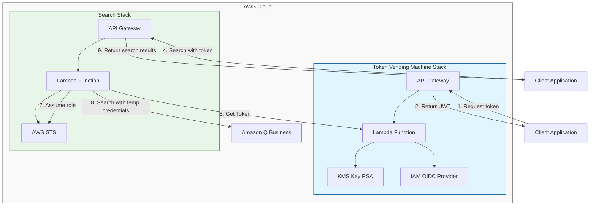

# Threat Model: Amazon Q Business Index Search API Java Sample

## Introduction

### Purpose
This threat model assesses the security considerations for the Amazon Q Business Index Search API Java Sample. The project demonstrates how to create a secure token-based authentication flow and search interface for Amazon Q Business, enabling developers to implement enterprise search capabilities in their applications using AWS CDK. It addresses the challenge of securely authenticating with Q Business APIs from custom applications using a trusted token issuer pattern.

### Project/Asset Overview
The Amazon Q Business Index Search API Java sample is a serverless architecture that demonstrates a secure pattern for integrating with Amazon Q Business search APIs. It has three major components:

1. **Token Vending Machine (TVM)**: Lambda-based OpenID Connect (OIDC) token issuer with JWT signing using KMS asymmetric keys. Includes:
   - Token endpoint for issuing signed JWTs
   - OpenID Configuration discovery endpoint
   - JWKS endpoint for key verification

2. **Search API Gateway**: Lambda-based API with STS assume-role-with-web-identity capability to securely call Amazon Q Business SearchRelevantContent API.

3. **Amazon Q Business Configuration**: Configured as a trusted identity provider to validate JWTs and enable token-based search access.

The project is built with AWS CDK using Java and is deployed via AWS CloudFormation.

**Third-party libraries used:**
- AWS SDK for Java v2
- AWS CDK libraries
- CDK-nag for security validation

### Assumptions

| ID    | Assumption                                                                                   | Comments                                                                      |
|-------|----------------------------------------------------------------------------------------------|-------------------------------------------------------------------------------|
| A-01  | The sample asset will be deployed into a non-production environment for educational purposes only. | The sample is not intended for production use without additional review.       |
| A-02  | AWS IAM is correctly configured to enforce principle of least privilege.                     | CDK-nag rules are used to enforce best practices.                             |
| A-03  | The Amazon Q Business application and index exist prior to deployment.                       | The CDK stack assumes Q Business has been set up.                             |
| A-04  | KMS key policies are maintained to ensure only authorized access to signing keys.            | KMS asymmetric keys are used for JWT signing.                                 |
| A-05  | API Gateway endpoints are publicly accessible, with specific auth mechanisms.                | The OIDC discovery endpoints must be public, but are protected with WAF.      |

### References
- [AWS CDK Documentation](https://docs.aws.amazon.com/cdk/latest/guide/home.html)
- [Amazon Q Business Documentation](https://docs.aws.amazon.com/amazonq/latest/business-use-dg/what-is-amazon-q-business.html)
- [OpenID Connect Specifications](https://openid.net/connect/)
- [AWS WAF Documentation](https://docs.aws.amazon.com/waf/latest/developerguide/waf-chapter.html)
- [AWS IAM Best Practices](https://docs.aws.amazon.com/IAM/latest/UserGuide/best-practices.html)

## Solution Architecture

### Architecture Diagram

The solution implements a token-based security model where a Token Vending Machine (TVM) acts as an OIDC provider to issue signed JWTs that can be exchanged for temporary AWS credentials via STS AssumeRoleWithWebIdentity. These credentials are then used to authenticate calls to the Amazon Q Business SearchRelevantContent API.

### Data Flow Diagrams

Authentication and Search Flow:

1. Client application makes a request to the TVM to authenticate
2. TVM uses KMS to sign a JWT token
3. TVM returns the signed JWT token to the client
4. Client sends the token to the Search API
5. Search API Lambda calls TVM to verify token
6. Search API Lambda passes token to STS 
7. STS returns temporary AWS credentials
8. Search API uses temporary credentials to call Amazon Q Business
9. Search results are returned to the client

### Main Functionality/Use Cases of the Solution

1. **Token Issuance**: Client applications request JWT tokens from the TVM service
2. **Token Verification**: Client JWT tokens are verified via JWKS endpoint 
3. **Secure Amazon Q Business Search**: Clients can search Amazon Q Business content through the secure API
4. **Temporary Credentials**: Federation using JWT tokens for temporary AWS credentials
5. **API Gateway Protection**: WAF and throttling protection for API endpoints

### APIs

| API | Method | Functionality | Callable from Internet | Authorized Callers | Comments |
|-----|--------|---------------|------------------------|---------------------|----------|
| /.well-known/openid-configuration | GET | OIDC discovery document | Yes | Any | Public endpoint as per OIDC spec |
| /.well-known/jwks.json | GET | JSON Web Key Set for token verification | Yes | Any | Public endpoint as per OIDC spec |
| /token | POST | Issues OIDC-compliant JWT tokens | Yes | Any, with rate limiting | Protected by WAF rate limiting |
| /search | POST | Searches Amazon Q Business index | Yes | Any with valid token | Token verified before search |

### Assets/Dependency

| Asset Name | Asset Usage | Data Type | Comments |
|------------|-------------|-----------|----------|
| KMS Asymmetric Keys | Used for signing JWTs in TokenVendingMachine | Service Resource | RSA-2048 keys with Sign/Verify capability, non-rotatable |
| API Gateway REST APIs | Public endpoints for TVM and Search | Service Resource | Protected with WAF, request validation, and logging |
| Lambda Functions | Business logic for token issuance and search | Service Resource | Isolated compute with least privilege |
| JWT Tokens | Authentication tokens | Authentication Data | Short-lived, signed tokens |
| Lambda CloudWatch Log Groups | Logging for Lambda functions | Service Logs | Retains logs for 30 days |
| API Gateway CloudWatch Log Groups | Access and method logging | Service Logs | Retains logs for 30 days |
| AWS WAF ACLs | Rate limiting protection | Service Resource | Protects APIs from abuse |
| IAM OIDC Provider | Trusted token validation | Service Resource | Validates JWT tokens for STS |
| IAM Role | Assumable role for Q Business access | Service Resource | Scoped permissions for search only |

## Threats & Mitigations

### Threat Actors

| Threat Actor # | Threat Actor Description |
|----------------|--------------------------|
| TA1 | A threat actor from the internet attempting to use the APIs |
| TA2 | A threat actor with leaked JWT token |
| TA3 | A threat actor attempting API manipulation |
| TA4 | A threat actor with AWS customer permissions |
| TA5 | A threat actor attempting to access backend services directly |

### Threat & Mitigation Detail

| Threat # | Priority | Threat | STRIDE | Affected Assets | Mitigations | Decision | Status/Notes |
|----------|----------|--------|--------|-----------------|-------------|----------|--------------|
| T-001 | High | A threat actor (TA1) could attempt to overwhelm the API endpoints with excessive requests | Denial of Service | API Gateway endpoints | M-001: WAF rate limiting rules to protect against excessive requests from IP addresses | Mitigate | Implemented |
| T-002 | High | A threat actor (TA2) could steal and reuse JWT tokens | Spoofing | JWT Tokens | M-002: Short-lived tokens (max 1 hour) with signature verification | Mitigate | Implemented |
| T-003 | Medium | A threat actor (TA3) could attempt to modify API requests in transit | Tampering | Data-in-transit | M-003: TLS encryption for all communications | Mitigate | Implemented by AWS services |
| T-004 | Medium | A threat actor (TA1) could attempt to exploit API vulnerabilities | Elevation of Privilege | API Gateway, Lambda | M-004: API Gateway request validation, WAF protection | Mitigate | Implemented |
| T-005 | Medium | A threat actor (TA4) could attempt to access IAM roles with excessive permissions | Elevation of Privilege | IAM Roles | M-005: Least privilege IAM policies, scoped to specific Q Business app | Mitigate | Implemented |
| T-006 | High | A threat actor (TA5) could attempt to forge tokens by compromising signing keys | Spoofing | KMS Keys | M-006: KMS protection for signing keys, no export of private key material | Mitigate | Implemented |
| T-007 | Medium | A threat actor (TA1) could attempt to perform reconnaissance through error messages | Information Disclosure | API responses | M-007: Limited error information in API responses | Mitigate | Implemented |
| T-008 | Medium | A threat actor (TA3) could attempt to bypass authorization by manipulating token claims | Spoofing, Elevation of Privilege | JWT Tokens | M-008: Token signature verification, STS verification | Mitigate | Implemented |
| T-009 | Low | A threat actor (TA1) could make unauthorized requests to admin operations | Elevation of Privilege | API Gateway, Lambda | M-009: No admin operations exposed via API Gateway | Avoid | Implemented |
| T-010 | Low | A threat actor (TA4) could attempt to access logs containing sensitive information | Information Disclosure | CloudWatch Logs | M-010: Log data limited to operational information, no sensitive data logging | Mitigate | Implemented |

## APPENDIX B - Mitigations

| Mitigation ID | Description | Implementation Details |
|---------------|-------------|------------------------|
| M-001 | WAF rate limiting | AWS WAF is configured with rate-based rules that limit requests from specific IP addresses to 1000 per 5 minutes |
| M-002 | Short-lived JWT tokens | Token Vending Machine issues tokens with expiration times limited to 1 hour maximum, enforced by Lambda validation |
| M-003 | TLS encryption | All API Gateway endpoints use TLS 1.2+ for in-transit encryption, managed by AWS |
| M-004 | API request validation | API Gateway request validators enforce proper request formats and required parameters |
| M-005 | Least privilege IAM | IAM policies are scoped to specific resources with minimal permissions using CDK-nag validation |
| M-006 | KMS key protection | KMS asymmetric keys are used for JWT signing, with private key material never exposed outside KMS |
| M-007 | Limited error details | API error responses provide minimal information to avoid leaking implementation details |
| M-008 | Token verification | Tokens are verified through signature validation and issuer/audience claims |
| M-009 | API access control | Admin operations are not exposed through public APIs, with access only through AWS console/APIs |
| M-010 | Log data protection | Logs are configured to avoid capturing sensitive user data, with proper IAM controls on log access |